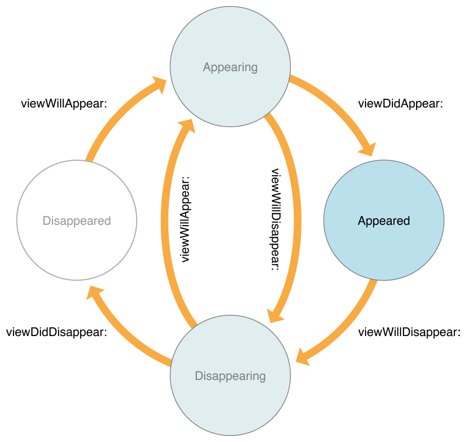

# Food Tracker

- [Start Developing iOS Apps (Swift)](https://developer.apple.com/library/prerelease/ios/referencelibrary/GettingStarted/DevelopiOSAppsSwift/index.html) lessons supplied by Apple.
- For running on iOS 8.0, I removed the StackView and re-layouted it.

### Outline

- [x] 1. [Build a Basic UI](https://developer.apple.com/library/prerelease/ios/referencelibrary/GettingStarted/DevelopiOSAppsSwift/Lesson2.html)
- [x] 2. [Connect the UI to Code](https://developer.apple.com/library/prerelease/ios/referencelibrary/GettingStarted/DevelopiOSAppsSwift/Lesson3.html)
- [x] 3. [Work with View Controllers](https://developer.apple.com/library/prerelease/ios/referencelibrary/GettingStarted/DevelopiOSAppsSwift/Lesson4.html)
- [x] 4. [Implement a Custom Control](https://developer.apple.com/library/prerelease/ios/referencelibrary/GettingStarted/DevelopiOSAppsSwift/Lesson5.html)
- [x] 5. [Define Your Data Model](https://developer.apple.com/library/prerelease/ios/referencelibrary/GettingStarted/DevelopiOSAppsSwift/Lesson6.html)
- [ ] 6. [Create a Table View](https://developer.apple.com/library/prerelease/ios/referencelibrary/GettingStarted/DevelopiOSAppsSwift/Lesson7.html)
- [ ] 7. [Implement Navigation](https://developer.apple.com/library/prerelease/ios/referencelibrary/GettingStarted/DevelopiOSAppsSwift/Lesson8.html)
- [ ] 8. [Implement Edit and Delete Behavior](https://developer.apple.com/library/prerelease/ios/referencelibrary/GettingStarted/DevelopiOSAppsSwift/Lesson9.html)
- [ ] 9. [Persist Data](https://developer.apple.com/library/prerelease/ios/referencelibrary/GettingStarted/DevelopiOSAppsSwift/Lesson10.html)

---

### Lesson 1: Build a Basic UI

#### Objective

- Create a project in Xcode
- Identify the function of key files that are created with an Xcode project template
- Open and switch between files in a project
- Run an app in Simulator
- Add, move, and resize UI elements in a storyboard
- Edit the attributes of UI elements in a storyboard using the Attributes inspector
- View and rearrange UI elements using the outline view
- Preview a storyboard UI using the Preview assistant editor
- Lay out a UI that automatically adapts to the user’s device size using Auto Layout

#### Note

- Select the **Auto-enable Return Key** checkbox. This change makes it impossible for the user to tap the Done key before typing text into the text field, ensuring that users can never enter an empty string as a meal name.
- The **outline view** — which appears on the left side of the canvas—lets you see a hierarchical representation of the objects in your storyboard.
- Within that hierarchy, views enclosed within a view are called **subviews**, and the parent view that encloses a view is called its **superview**.
- **intrinsic content size**: The minimum size needed to display all the content in a view without clipping or distorting that content.

---

### Lesson 2: Connect the UI to Code

#### Objective

- Explain the relationship between a scene in a storyboard and the underlying view controller
- Create outlet and action connections between UI elements in a storyboard and source code
- Process user input from a text field and display the result in the UI
- Make a class conform to a protocol
- Understand the delegation pattern
- Follow the target-action pattern when designing app architecture

#### Note

- A comment that begins with the characters `// MARK:` is a special type of comment that’s used to organize your code and to help you (and anybody else who reads your code) navigate through it.
- The **IBOutlet** attribute tells Xcode that you can connect to the property from Interface Builder (which is why the attribute has the **IB** prefix). The **weak** keyword means that it’s possible for that property to have no value (be **nil**) at some point in its life.
  - This exclamation point indicates that the type is an [implicitly unwrapped optional](https://developer.apple.com/library/prerelease/ios/referencelibrary/GettingStarted/DevelopiOSAppsSwift/GlossaryDefinitions.html#//apple_ref/doc/uid/TP40015214-CH12-SW50), which is an optional type that will always have a value after the value is first set.
- iOS apps are based on [event-driven programming](https://developer.apple.com/library/prerelease/ios/referencelibrary/GettingStarted/DevelopiOSAppsSwift/GlossaryDefinitions.html#//apple_ref/doc/uid/TP40015214-CH12-SW38). That is, the flow of the app is determined by events: system events and user actions.
- An **action** (or an action method) is a piece of code that’s linked to an event that can occur in your app.
- When adding an action to a button, you may have noticed that the value of the Type field defaults to **AnyObject**. In Swift, AnyObject is a type used to describe an object that can belong to any class. Specifying the type of this action method to be **UIButton** means that only button objects can connect to this action.
- A **delegate** is an object that acts on behalf of, or in coordination with, another object.
- When the user taps a text field, it automatically becomes **first responder**. In an app, the first responder is an object that is first on the line for receiving many kinds of app events, including key events, motion events, and action messages, among others.
- `textFieldShouldReturn(_:)` - get called when the user taps Return (or in this case, Done) on the keyboard.
- `textFieldDidEndEditing(_:)` - give you a chance to read the information entered into the text field and do something with it.
- Good habits:
```
    // MARK: Properties

    // MARK: Actions

    // MARK: UITextFieldDelegate
```

---

### Lesson 3: Work with View Controllers

#### Objective

- Understand the view controller life cycle and when its callbacks occurs, such as **viewDidLoad**, **viewWillAppear** and **viewDidAppear**
- Pass data between view controllers
- Dismiss a view controller
- Use gesture recognizers as an additional level of generating events
- Anticipate object behavior based on the **UIView/UIControl** class hierarchy
- Use the asset catalog to add image assets to a project

#### Note

- **UIViewController** methods get called as follows:
  - `viewDidLoad()` — Called when the view controller’s content view (the top of its view hierarchy) is created and loaded from a storyboard. This method is intended for initial setup. However, because views may be purged due to limited resources in an app, there is no guarantee that it will be called only once.
  - `viewWillAppear()` — Intended for any operations that you want always to occur before the view becomes visible. Because a view’s visibility may be toggled or obscured by other views, this method is always called immediately before the content view appears onscreen.
  - `viewDidAppear()` — Intended for any operations that you want to occur as soon as the view becomes visible, such as fetching data or showing an animation. Because a view’s visibility may be toggled or obscured by other views, this method is always called immediately after the content view appears onscreen.
- View Controller Life Cycle:
  
- Attach a tap gesture recognizer (`UITapGestureRecognizer`) to the image view and make sure **User Interaction Enable** checkbox checked; otherwise, the tap gesture won't work.

---

### Lesson 4: Implement a Custom Controll

#### Objective

- Create and associate custom source code files with elements in a storyboard
- Define a custom class
- Implement an initializer on a custom class
- Use **UIView** as a container
- Understand how to display views programmatically

#### Note

- Initialization of `UIView`
  - `init(frame:)` - for the frame, so that you can manually add the view to your UI
  - `init?(coder:)` - for the storyboard
- Every `UIView` subclass that implements an initializer must include an implementation of `init?(coder:)`.
- A **property observer** observes and responds to changes in a property’s value. Property observers are called every time a property’s value is set, and can be used to perform work immediately before or after the value changes.

---

### Lesson 5: Define Your Data Model

#### Objective

- Create a data model
- Write failable initializers on a custom class
- Demonstrate a conceptual understanding of the difference between failable and nonfailable initializers
- Test a data model by writing and running unit tests

#### Note

- By default, a Swift file imports the **Foundation** framework so you can work with Foundation data structures in your code. You’ll be working with a class from the UIKit framework, so you need to include UIKit in your import statement. Importing UIKit also gets you access to Foundation, so you can remove the redundant import to Foundation.
- An initializer written like `init?()` is known as a **failable initializer**, which means that it’s possible for the initializer to return **nil** after initialization.
- The XCTest framework, which *Unit Test Case Class* imports, is Xcode’s testing framework.
  - The main types of tests you can write are **functional tests** (to check that everything is producing the values you expect) and **performance tests** (to check that your code is performing as fast as you expect it to).
  - Start any method that you want to run as a test with “test” in the title.
- Unit testing is an essential part of writing code because it helps you catch errors that you might otherwise overlook. As implied by their name, it’s important to keep unit tests modular. Each test should check for a specific, basic type of behavior.

---
