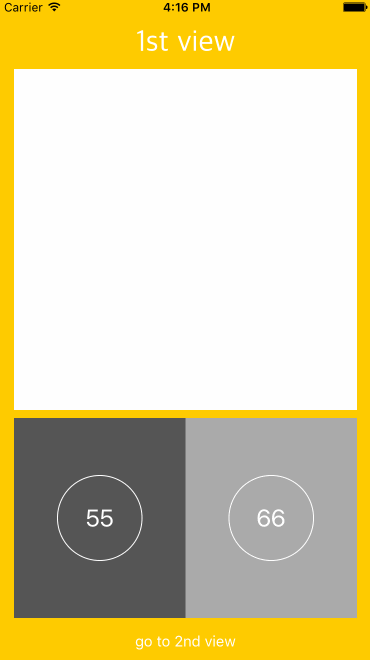

# Reusable View

- [iOS Basically: Reusable UIView - Programming in Swift (Part 1)](https://www.youtube.com/watch?v=o3MawJVxTgk)
- [iOS Basically: Reusable Elements / UIButton - Programming in Swift (Part 2)](https://www.youtube.com/watch?v=2ESU5hVRBPc)
- [iOS Basically: Reusable Elements / UIButton - Programming in Swift (Part 3)](https://www.youtube.com/watch?v=pDHPA-CnuRw)
- [Swift: Reusable UIView in storyboard and sizing constraints](http://stackoverflow.com/questions/32061599/swift-reusable-uiview-in-storyboard-and-sizing-constraints)

### Features:

  * [x] make a resuable view
  * [x] layout it in storyboard and set size constraints
  * [x] let it delegate to other view controller

### Note:

- `nib` 檔 `File's Owner` 的 Custom Class 要記得修改，才能拉 `@IBAction` 和 `@IBOutlet`

### Demo:

